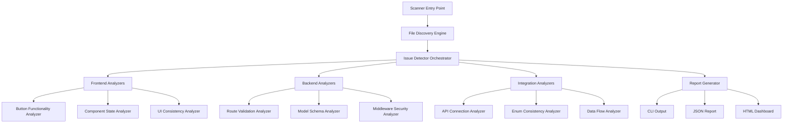

# Code Quality Scanner Design

## Overview

This design document outlines a comprehensive code quality scanner for the china5 logistics OMS application. The scanner will recursively analyze all project files to identify various types of issues including button functionality problems, frontend-backend connection issues, enum validation problems, and other code quality concerns.

## Technology Stack & Dependencies

**Target Application Stack:**
- Frontend: React 18, Vite, Tailwind CSS, Zustand
- Backend: Express.js, MongoDB, Mongoose
- Communication: REST APIs, JWT Authentication
- UI Components: shadcn/ui, Radix UI

**Scanner Implementation:**
- Language: Node.js/JavaScript
- Static Analysis: ESLint, TypeScript Compiler API
- File Processing: glob, fs-extra
- Pattern Matching: Regular expressions, AST parsing
- Reporting: JSON, HTML, CLI output

## Architecture

### Core Scanner Components



### Issue Detection Categories

#### 1. Button Functionality Issues
- **Missing onClick Handlers**: Buttons without proper event handlers
- **Broken Navigation**: Navigation buttons with invalid routes
- **Disabled State Logic**: Incorrect button disable/enable conditions
- **Form Submission Issues**: Submit buttons without proper validation

#### 2. Frontend-Backend Connection Issues
- **API Endpoint Mismatches**: Frontend calls to non-existent backend routes
- **Request/Response Schema Mismatches**: Data structure inconsistencies
- **Authentication Token Issues**: Missing or incorrect JWT handling
- **Error Handling Gaps**: Missing error states in API calls

#### 3. Enum Validation Issues  
- **Enum Value Mismatches**: Frontend using invalid enum values
- **Missing Validation**: Routes accepting invalid enum values
- **Inconsistent Enum Definitions**: Different enum values across models
- **Type Safety Issues**: String literals instead of proper enums

#### 4. General Code Quality Issues
- **Unused Imports/Variables**: Dead code detection
- **Inconsistent Error Handling**: Different error patterns across files
- **Security Vulnerabilities**: Common security anti-patterns
- **Performance Issues**: Inefficient patterns and memory leaks

## Component Architecture

### File Discovery Engine

```javascript
class FileDiscoveryEngine {
  constructor(rootPath, excludePatterns = []) {
    this.rootPath = rootPath;
    this.excludePatterns = excludePatterns;
  }

  async discoverFiles() {
    return {
      frontend: await this.findFiles('client/src/**/*.{js,jsx,ts,tsx}'),
      backend: await this.findFiles('server/**/*.js'),
      tests: await this.findFiles('**/*.test.{js,jsx}'),
      configs: await this.findFiles('*.{json,js,config.js}')
    };
  }
}
```

### Issue Detector Orchestrator

```javascript
class IssueDetectorOrchestrator {
  constructor() {
    this.detectors = [
      new ButtonFunctionalityAnalyzer(),
      new ApiConnectionAnalyzer(),
      new EnumConsistencyAnalyzer(),
      new ValidationAnalyzer(),
      new SecurityAnalyzer()
    ];
  }

  async analyzeFiles(fileGroups) {
    const issues = [];
    
    for (const detector of this.detectors) {
      const detectorIssues = await detector.analyze(fileGroups);
      issues.push(...detectorIssues);
    }
    
    return this.categorizeIssues(issues);
  }
}
```

### Button Functionality Analyzer

**Detection Patterns:**
- Buttons without onClick handlers
- Navigation buttons with incorrect routes
- Form submit buttons without validation
- Disabled button logic errors

```javascript
class ButtonFunctionalityAnalyzer {
  async analyze(files) {
    const issues = [];
    
    for (const file of files.frontend) {
      const content = await fs.readFile(file, 'utf8');
      const ast = parseJSX(content);
      
      // Check for buttons without onClick handlers
      const buttonElements = findButtonElements(ast);
      
      buttonElements.forEach(button => {
        if (!this.hasClickHandler(button)) {
          issues.push({
            type: 'BUTTON_NO_HANDLER',
            severity: 'medium',
            file: file,
            line: button.loc.start.line,
            message: 'Button element without onClick handler',
            suggestion: 'Add onClick handler or use proper form submission'
          });
        }
        
        if (this.hasNavigationIntent(button) && !this.hasValidRoute(button)) {
          issues.push({
            type: 'BUTTON_INVALID_NAVIGATION',
            severity: 'high',
            file: file,
            line: button.loc.start.line,
            message: 'Navigation button with invalid or missing route',
            suggestion: 'Verify route exists in routing configuration'
          });
        }
      });
    }
    
    return issues;
  }
}
```

### API Connection Analyzer

**Detection Focus:**
- Frontend API calls to non-existent backend routes
- Mismatched request/response schemas
- Missing error handling
- Authentication issues

```javascript
class ApiConnectionAnalyzer {
  constructor() {
    this.backendRoutes = new Map();
    this.frontendApiCalls = new Map();
  }

  async analyze(files) {
    // First pass: Extract backend routes
    await this.extractBackendRoutes(files.backend);
    
    // Second pass: Extract frontend API calls
    await this.extractFrontendApiCalls(files.frontend);
    
    // Third pass: Compare and find mismatches
    return this.findConnectionIssues();
  }

  async extractBackendRoutes(backendFiles) {
    for (const file of backendFiles) {
      const content = await fs.readFile(file, 'utf8');
      const routes = this.parseExpressRoutes(content);
      
      routes.forEach(route => {
        this.backendRoutes.set(`${route.method}:${route.path}`, {
          file: file,
          line: route.line,
          middleware: route.middleware,
          validation: route.validation
        });
      });
    }
  }

  findConnectionIssues() {
    const issues = [];
    
    this.frontendApiCalls.forEach((callInfo, endpoint) => {
      if (!this.backendRoutes.has(endpoint)) {
        issues.push({
          type: 'API_ENDPOINT_NOT_FOUND',
          severity: 'high',
          file: callInfo.file,
          line: callInfo.line,
          message: `Frontend calls ${endpoint} but backend route not found`,
          suggestion: 'Create missing backend route or fix frontend URL'
        });
      }
    });
    
    return issues;
  }
}
```

### Enum Consistency Analyzer

**Detection Focus:**
- Enum definitions across models
- Frontend usage of enum values
- Validation inconsistencies
- Type safety issues

```javascript
class EnumConsistencyAnalyzer {
  async analyze(files) {
    const modelEnums = await this.extractModelEnums(files.backend);
    const frontendEnumUsage = await this.extractFrontendEnumUsage(files.frontend);
    const validationEnums = await this.extractValidationEnums(files.backend);
    
    return this.findEnumInconsistencies(modelEnums, frontendEnumUsage, validationEnums);
  }

  async extractModelEnums(backendFiles) {
    const enums = new Map();
    
    for (const file of backendFiles) {
      if (file.includes('models/')) {
        const content = await fs.readFile(file, 'utf8');
        const enumDefinitions = this.parseMongooseEnums(content);
        
        enumDefinitions.forEach(enumDef => {
          enums.set(enumDef.field, {
            values: enumDef.values,
            file: file,
            line: enumDef.line
          });
        });
      }
    }
    
    return enums;
  }

  findEnumInconsistencies(modelEnums, frontendUsage, validationEnums) {
    const issues = [];
    
    // Check frontend usage against model definitions
    frontendUsage.forEach((usage, enumField) => {
      const modelEnum = modelEnums.get(enumField);
      
      if (modelEnum) {
        usage.values.forEach(usedValue => {
          if (!modelEnum.values.includes(usedValue.value)) {
            issues.push({
              type: 'ENUM_INVALID_VALUE',
              severity: 'high',
              file: usedValue.file,
              line: usedValue.line,
              message: `Invalid enum value '${usedValue.value}' for field '${enumField}'`,
              suggestion: `Use one of: ${modelEnum.values.join(', ')}`
            });
          }
        });
      }
    });
    
    return issues;
  }
}
```

## Data Models & Issue Tracking

### Issue Schema

```javascript
const IssueSchema = {
  id: String,
  type: String, // BUTTON_NO_HANDLER, API_ENDPOINT_NOT_FOUND, etc.
  category: String, // BUTTON, API_CONNECTION, ENUM, VALIDATION, SECURITY
  severity: String, // low, medium, high, critical
  file: String,
  line: Number,
  column: Number,
  message: String,
  description: String,
  suggestion: String,
  codeSnippet: String,
  relatedFiles: [String],
  estimatedFixTime: Number, // minutes
  tags: [String],
  detectedAt: Date
};
```

### Issue Categories & Priorities

| Category | Examples | Priority Weight |
|----------|----------|-----------------|
| **Critical Security** | SQL Injection, XSS vulnerabilities | 100 |
| **Broken Functionality** | Button not working, API errors | 90 |
| **Data Inconsistency** | Enum mismatches, validation gaps | 80 |
| **Performance Issues** | Memory leaks, inefficient queries | 70 |
| **Code Quality** | Unused variables, inconsistent patterns | 50 |
| **Documentation** | Missing comments, outdated docs | 30 |

## Specific Issue Detection Rules

### Frontend Issue Detection

#### Button Analysis Rules
```javascript
const buttonRules = [
  {
    name: 'button-missing-onclick',
    pattern: /<Button[^>]*(?!.*onClick)[^>]*>/,
    severity: 'medium',
    message: 'Button without onClick handler'
  },
  {
    name: 'form-submit-no-validation',
    pattern: /type="submit".*(?!.*onSubmit)/,
    severity: 'high', 
    message: 'Submit button without form validation'
  },
  {
    name: 'navigation-button-invalid-route',
    check: (node) => {
      return node.props?.onClick?.includes('navigate') && 
             !this.isValidRoute(node.props.onClick);
    },
    severity: 'high',
    message: 'Navigation to non-existent route'
  }
];
```

#### State Management Issues
```javascript
const stateRules = [
  {
    name: 'useState-not-used',
    pattern: /const \[(\w+),\s*set\w+\] = useState/,
    check: (match, content) => {
      const varName = match[1];
      return !content.includes(varName) || 
             content.indexOf(varName, match.index) === -1;
    },
    severity: 'low',
    message: 'Unused state variable'
  },
  {
    name: 'missing-loading-state',
    check: (node) => {
      return node.type === 'axios' && 
             !this.hasLoadingState(node.parent);
    },
    severity: 'medium',
    message: 'API call without loading state'
  }
];
```

### Backend Issue Detection  

#### Route Validation Issues
```javascript
const routeRules = [
  {
    name: 'route-no-validation',
    pattern: /router\.(get|post|put|delete)\(['"][^'"]*['"],\s*(?!.*body\()/,
    severity: 'high',
    message: 'Route without input validation'
  },
  {
    name: 'missing-auth-middleware',
    pattern: /router\.(post|put|delete)\(['"][^'"]*['"],\s*(?!.*auth)/,
    severity: 'critical',
    message: 'Potentially unprotected route'
  },
  {
    name: 'inconsistent-error-handling',
    check: (routeNode) => {
      return !this.hasTryCatchBlock(routeNode) && 
             !this.hasErrorMiddleware(routeNode);
    },
    severity: 'medium',
    message: 'Route without proper error handling'
  }
];
```

#### Model Schema Issues
```javascript
const modelRules = [
  {
    name: 'enum-without-validation',
    pattern: /enum:\s*\[(.*?)\](?!.*validate)/,
    severity: 'medium',
    message: 'Enum field without frontend validation'
  },
  {
    name: 'missing-required-validation',
    pattern: /type:\s*String(?!.*required)/,
    severity: 'low',
    message: 'String field without required validation'
  },
  {
    name: 'number-without-constraints',
    pattern: /type:\s*Number(?!.*(min|max))/,
    severity: 'medium', 
    message: 'Number field without min/max constraints'
  }
];
```

### Integration Issue Detection

#### API Contract Validation
```javascript
class ApiContractValidator {
  validateContracts(frontendCalls, backendRoutes) {
    const issues = [];
    
    frontendCalls.forEach(call => {
      const matchingRoute = this.findMatchingRoute(call, backendRoutes);
      
      if (!matchingRoute) {
        issues.push({
          type: 'API_ROUTE_NOT_FOUND',
          severity: 'critical',
          message: `Frontend calls ${call.method} ${call.url} but route not defined`
        });
        return;
      }
      
      // Validate request schema
      if (call.data && !this.validateRequestSchema(call.data, matchingRoute.validation)) {
        issues.push({
          type: 'API_REQUEST_SCHEMA_MISMATCH',
          severity: 'high',
          message: 'Request data doesn't match backend validation'
        });
      }
      
      // Validate response handling
      if (!this.validateResponseHandling(call.then, matchingRoute.responseSchema)) {
        issues.push({
          type: 'API_RESPONSE_SCHEMA_MISMATCH', 
          severity: 'medium',
          message: 'Frontend expects different response structure'
        });
      }
    });
    
    return issues;
  }
}
```

## Issue Categorization & Reporting

### Severity Classification

```javascript
class IssueSeverityClassifier {
  classifyIssue(issue) {
    const severityRules = {
      critical: [
        'security vulnerabilities',
        'authentication bypasses', 
        'data corruption risks',
        'system crash potential'
      ],
      high: [
        'broken functionality',
        'API endpoint mismatches',
        'invalid enum values',
        'missing validation'
      ],
      medium: [
        'performance issues',
        'inconsistent patterns',
        'missing error handling',
        'code duplication'
      ],
      low: [
        'unused variables',
        'formatting issues',
        'missing comments',
        'minor optimizations'
      ]
    };
    
    for (const [severity, patterns] of Object.entries(severityRules)) {
      if (patterns.some(pattern => issue.description.includes(pattern))) {
        return severity;
      }
    }
    
    return 'low';
  }
}
```

### Report Generator

```javascript
class ReportGenerator {
  generateReport(issues, format = 'json') {
    const report = {
      summary: this.generateSummary(issues),
      issues: this.categorizeIssues(issues),
      metrics: this.calculateMetrics(issues),
      recommendations: this.generateRecommendations(issues),
      generatedAt: new Date().toISOString()
    };
    
    switch (format) {
      case 'json':
        return JSON.stringify(report, null, 2);
      case 'html':
        return this.generateHtmlReport(report);
      case 'cli':
        return this.generateCliReport(report);
      default:
        return report;
    }
  }

  generateSummary(issues) {
    return {
      totalIssues: issues.length,
      critical: issues.filter(i => i.severity === 'critical').length,
      high: issues.filter(i => i.severity === 'high').length,
      medium: issues.filter(i => i.severity === 'medium').length,
      low: issues.filter(i => i.severity === 'low').length,
      categories: this.groupByCategory(issues)
    };
  }
}
```

## Testing Strategy

### Unit Tests for Analyzers

```javascript
describe('ButtonFunctionalityAnalyzer', () => {
  let analyzer;
  
  beforeEach(() => {
    analyzer = new ButtonFunctionalityAnalyzer();
  });
  
  it('should detect buttons without onClick handlers', async () => {
    const testCode = `
      function TestComponent() {
        return <Button>Click Me</Button>;
      }
    `;
    
    const issues = await analyzer.analyzeCode(testCode, 'test.jsx');
    
    expect(issues).toHaveLength(1);
    expect(issues[0].type).toBe('BUTTON_NO_HANDLER');
    expect(issues[0].severity).toBe('medium');
  });
  
  it('should not flag buttons with proper handlers', async () => {
    const testCode = `
      function TestComponent() {
        return <Button onClick={() => navigate('/home')}>Home</Button>;
      }
    `;
    
    const issues = await analyzer.analyzeCode(testCode, 'test.jsx');
    
    expect(issues).toHaveLength(0);
  });
  
  it('should detect navigation to invalid routes', async () => {
    const testCode = `
      function TestComponent() {
        return <Button onClick={() => navigate('/invalid-route')}>Go</Button>;
      }
    `;
    
    analyzer.setValidRoutes(['/home', '/dashboard', '/orders']);
    const issues = await analyzer.analyzeCode(testCode, 'test.jsx');
    
    expect(issues).toHaveLength(1);
    expect(issues[0].type).toBe('BUTTON_INVALID_NAVIGATION');
  });
});
```

### Integration Tests

```javascript
describe('Full Scanner Integration', () => {
  it('should scan entire codebase and generate report', async () => {
    const scanner = new CodeQualityScanner('./test-project');
    const report = await scanner.scan();
    
    expect(report).toHaveProperty('summary');
    expect(report).toHaveProperty('issues');
    expect(report).toHaveProperty('metrics');
    
    expect(report.summary.totalIssues).toBeGreaterThan(0);
    expect(report.issues).toBeInstanceOf(Array);
  });
  
  it('should handle large codebases efficiently', async () => {
    const scanner = new CodeQualityScanner('./large-test-project');
    
    const startTime = Date.now();
    await scanner.scan();
    const endTime = Date.now();
    
    // Should complete within reasonable time
    expect(endTime - startTime).toBeLessThan(30000); // 30 seconds
  });
});
```

## CLI Interface & Usage

### Command Line Interface

```bash
# Basic scan
npx code-quality-scanner ./src

# Scan with specific analyzers
npx code-quality-scanner ./src --analyzers=buttons,api,enums

# Generate different output formats
npx code-quality-scanner ./src --format=html --output=./reports/

# Scan with custom configuration
npx code-quality-scanner ./src --config=./scanner.config.js

# Watch mode for continuous scanning
npx code-quality-scanner ./src --watch

# Filter by severity
npx code-quality-scanner ./src --min-severity=medium

# Exclude specific patterns
npx code-quality-scanner ./src --exclude="**/*.test.js,**/node_modules/**"
```

### Configuration File

```javascript
// scanner.config.js
module.exports = {
  analyzers: {
    buttons: {
      enabled: true,
      rules: {
        'button-missing-onclick': 'medium',
        'navigation-invalid-route': 'high'
      }
    },
    api: {
      enabled: true,
      baseUrl: 'http://localhost:5001/api',
      timeout: 5000
    },
    enums: {
      enabled: true,
      strictMode: true
    },
    security: {
      enabled: true,
      rules: ['xss', 'injection', 'auth-bypass']
    }
  },
  
  output: {
    format: ['json', 'html'],
    directory: './reports',
    includeCodeSnippets: true
  },
  
  exclude: [
    '**/node_modules/**',
    '**/*.test.js',
    '**/dist/**'
  ],
  
  performance: {
    maxConcurrency: 10,
    memoryLimit: '2GB'
  }
};
```