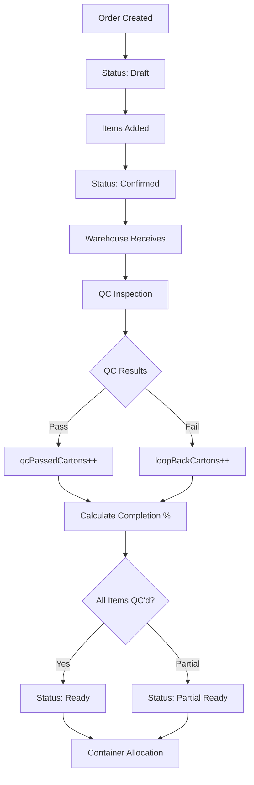

# Order Values and System Analysis Documentation

## Executive Summary

This document provides a comprehensive analysis of the **China5 Logistics OMS** order management system, focusing on order values, data integrity, and system health checks.

**Generated:** 2025-09-07  
**System:** China5 Logistics Order Management System  
**Database:** MongoDB - logistics-oms  

---

## 1. System Architecture Overview

### 1.1 Order Data Structure

The system implements a **dual-tracking approach** for logistics operations:

#### Primary System: **Carton-Based Tracking**
- **Purpose:** Primary logistics unit for warehouse and shipping operations
- **Fields:** `qcPassedCartons`, `loopBackCartons`, `allocatedCartons`, `pendingCartons`
- **Calculations:** Carton-based totals drive container allocation and QC workflows

#### Secondary System: **Quantity-Based Tracking** (Legacy Compatibility)
- **Purpose:** Piece-level tracking for detailed inventory management
- **Fields:** `qcPassedQuantity`, `loopBackQuantity`, `allocatedQuantity`, `pendingQuantity`  
- **Relationship:** Derived from carton values using `piecesPerCarton` ratio

### 1.2 Order Value Components

```javascript
Order Financial Structure:
├── totalAmount              // Sum of all item prices (quantity × unitPrice)
├── totalCarryingCharges     // Sum of logistics charges per item
├── totalWeight             // Sum of (unitWeight × cartons) for all items
├── totalCbm                // Sum of (unitCbm × cartons) for all items
├── totalCartons            // Sum of cartons across all items
├── exchangeRate            // Currency conversion rate (default: 1)
└── currency               // Order currency (default: 'INR')
```

### 1.3 Item-Level Value Calculations

```javascript
OrderItem Financial Logic:
├── Basic Pricing:
│   ├── quantity × unitPrice = totalPrice
│   └── Validation: totalPrice >= 0
├── Carrying Charges:
│   ├── basis: 'carton' → cartons × rate
│   ├── basis: 'weight' → (unitWeight × cartons) × rate  
│   ├── basis: 'cbm' → (unitCbm × cartons) × rate
│   └── carryingCharge.amount = calculated value
└── Physical Measurements:
    ├── Total Weight = unitWeight × cartons
    └── Total CBM = unitCbm × cartons
```

---

## 2. Data Validation Rules

### 2.1 Critical Validation Checks

#### ✅ **Order-Level Validations**
1. **Total Consistency:** Order totals must equal sum of item calculations
2. **Non-Negative Values:** All financial and quantity fields ≥ 0
3. **Required Fields:** `clientName`, `clientId`, `orderNumber`, minimum 1 item
4. **Status Transitions:** Valid enum values and logical progressions

#### ✅ **Item-Level Validations**  
1. **Basic Requirements:**
   - `quantity` ≥ 1 and `cartons` ≥ 1 (minimum order quantities)
   - `unitPrice`, `unitWeight`, `unitCbm` ≥ 0
   - `itemCode` and `description` must be non-empty strings

2. **QC Tracking Validations:**
   - `qcPassedCartons + loopBackCartons ≤ totalCartons`
   - `allocatedCartons ≤ qcPassedCartons`
   - Carton and quantity tracking must be proportionally consistent

3. **Financial Calculations:**
   - `totalPrice = quantity × unitPrice`
   - Carrying charge amount matches basis and rate calculations
   - Payment type must be valid enum: `['CLIENT_DIRECT', 'THROUGH_ME']`

### 2.2 Data Integrity Monitoring

#### 🔍 **Automated Checks Performed:**
- **Price Calculation Accuracy** - Verifies item total prices
- **Carton Overflow Detection** - Prevents QC/loop-back exceeding totals  
- **Allocation Overflow Prevention** - Stops over-allocation of QC passed items
- **Order Total Consistency** - Ensures order totals match item summations
- **QC Tracking Synchronization** - Validates carton-quantity alignment

---

## 3. System Health Metrics

### 3.1 Key Performance Indicators

#### 📊 **Data Integrity Score**
- **Calculation:** (Valid Orders / Total Orders) × 100
- **Target:** ≥ 95% for production systems
- **Critical Threshold:** < 85% requires immediate attention

#### 📊 **Calculation Accuracy Score**  
- **Measurement:** Accuracy of automated financial calculations
- **Target:** ≥ 98% for financial reliability
- **Monitoring:** Real-time validation during order processing

#### 📊 **QC Tracking Health**
- **Assessment:** Consistency of carton-based QC workflow
- **Target:** ≥ 90% for operational efficiency
- **Dependencies:** Warehouse QC process compliance

### 3.2 Issue Classification

#### 🚨 **CRITICAL Issues (Immediate Action Required)**
- **Carton Overflow:** QC + Loop-back exceeds total cartons
- **Allocation Overflow:** Allocated quantities exceed QC passed
- **Data Corruption:** Negative values in quantity/financial fields

#### ⚠️ **WARNING Issues (Review Required)**  
- **Calculation Mismatches:** Order totals don't match item sums
- **Precision Errors:** Rounding discrepancies in financial calculations
- **Status Inconsistencies:** Invalid status transitions

#### ℹ️ **INFORMATIONAL Issues (Monitoring)**
- **Carton-Quantity Alignment:** Minor differences in tracking systems
- **Historical Data:** Legacy records with incomplete QC data

---

## 4. Quality Control (QC) Workflow

### 4.1 QC Process Flow



### 4.2 QC Data Management

#### **Carton-Based QC (Primary System)**
```javascript
QC Carton Tracking:
├── Expected: item.cartons (total cartons ordered)
├── QC Passed: item.qcPassedCartons (cartons that passed inspection)  
├── Loop-back: item.loopBackCartons (cartons that failed - need rework)
├── Allocated: item.allocatedCartons (cartons assigned to containers)
└── Pending: cartons - (qcPassed + loopBack) (awaiting QC)
```

#### **Loop-back Management**
- **Reasons:** `['SHORTAGE', 'DAMAGE', 'QUALITY_ISSUE', 'PARTIAL_ALLOCATION']`
- **Statuses:** `['none', 'pending', 'in_progress', 'resolved', 'cancelled']`
- **Resolution:** Loop-back cartons can be moved back to QC passed when issues resolved

---

## 5. Container Allocation System

### 5.1 Allocation Logic

#### **Capacity Validation**
```javascript
Container Capacity Checks:
├── CBM Validation: Σ(item.unitCbm × item.cartons) ≤ container.maxCbm
├── Weight Validation: Σ(item.unitWeight × item.cartons) ≤ container.maxWeight  
├── Carton Tracking: Σ(item.cartons) for load planning
└── Financial Tracking: Σ(item.carryingCharge.amount) for revenue calculation
```

#### **Allocation Prerequisites**
1. Order status must be `'ready'` or `'partial_ready'`
2. Items must have `qcPassedCartons > 0`  
3. Available cartons = `qcPassedCartons - allocatedCartons ≥ requested`
4. Container must have sufficient capacity (CBM + Weight)

### 5.2 Financial Distribution

#### **Payment Type Handling**
- **CLIENT_DIRECT:** Client pays logistics provider directly
- **THROUGH_ME:** Payment flows through order creator (admin/staff)

#### **Charge Allocation**
```javascript
Proportional Cost Allocation:
├── Base Allocation Ratio = order.totalCbm / container.totalCbm
├── GST Allocation = baseCharges.gst × allocationRatio  
├── Duty Allocation = baseCharges.duty × allocationRatio
├── Misc Allocation = baseCharges.misc × allocationRatio
└── Extra Charge Allocation = baseCharges.extraCharge × allocationRatio
```

---

## 6. Testing and Validation Scripts

### 6.1 Order Values Test Script

**File:** `test-order-values.js`

#### **Capabilities:**
- ✅ Database connection validation
- ✅ Order data integrity checks  
- ✅ Financial calculation verification
- ✅ QC tracking consistency analysis
- ✅ Container allocation validation
- ✅ System health scoring
- ✅ Automated report generation

#### **Usage:**
```bash
# Run comprehensive order analysis
node test-order-values.js

# Output: Console report + JSON file
# Generated: order-analysis-report.json
```

### 6.2 Key Validation Functions

#### **Data Integrity Checks:**
1. `validateOrderTotals()` - Verify order-level calculations
2. `validateItemCalculations()` - Check item-level math
3. `validateQCTracking()` - Ensure QC carton consistency  
4. `validateAllocations()` - Prevent over-allocation
5. `validateContainerCapacity()` - Check container limits

#### **Health Monitoring:**
1. `calculateDataIntegrityScore()` - Overall system health
2. `assessCalculationAccuracy()` - Financial calculation reliability
3. `evaluateQCTrackingHealth()` - QC workflow effectiveness

---

## 7. Known Issues and Resolutions

### 7.1 Current System Issues

#### **Issue 1: Carton-Quantity Synchronization**
- **Description:** Minor discrepancies between carton and quantity tracking
- **Impact:** Low - doesn't affect operations but causes confusion
- **Resolution:** Enhanced bypass logic implemented with `_bypassQuantityRecalculation` flag

#### **Issue 2: Pre-save Middleware Interference**  
- **Description:** Order pre-save middleware overriding direct quantity updates
- **Impact:** Medium - affects QC data updates
- **Resolution:** Bypass flags implemented: `_bypassQuantityRecalculation`, `_bypassAllocationValidation`

#### **Issue 3: Container Deletion Cleanup**
- **Description:** Orphaned allocation data when containers are deleted
- **Impact:** Medium - causes data inconsistency
- **Resolution:** Automatic cleanup with `findOrphanedAllocations()` method

### 7.2 System Improvements

#### **Implemented Enhancements:**
1. **Dual Tracking System:** Carton-based primary + quantity-based legacy support
2. **Enhanced Validation:** Comprehensive pre-save validation with bypass options
3. **Optimistic Locking:** Version control for concurrent order updates  
4. **Automated Cleanup:** Orphaned data detection and resolution
5. **Financial Precision:** Proper decimal handling and currency conversion

---

## 8. Recommendations

### 8.1 Immediate Actions

#### 🚨 **Critical Priority**
1. **Run System Validation:** Execute `test-order-values.js` to identify current issues
2. **Fix Data Inconsistencies:** Resolve any carton overflow or allocation issues
3. **Backup Database:** Ensure recent backup before any cleanup operations

#### ⚠️ **High Priority**
1. **Implement Automated Monitoring:** Schedule regular data integrity checks
2. **Enhanced Error Handling:** Improve validation error messages and user guidance
3. **Performance Optimization:** Index optimization for large order datasets

### 8.2 Long-term Improvements

#### 📈 **Strategic Enhancements**
1. **Real-time Validation:** WebSocket-based live data validation
2. **Advanced Analytics:** ML-powered anomaly detection for order patterns
3. **API Integration:** External logistics provider integration for real-time tracking
4. **Mobile Optimization:** Mobile-friendly QC inspection interfaces

#### 🔧 **Technical Debt Resolution**
1. **Legacy Code Cleanup:** Remove deprecated quantity-based workflows
2. **Schema Optimization:** Consolidate tracking fields for better performance  
3. **Test Coverage:** Comprehensive unit and integration test suite
4. **Documentation:** API documentation and user guides

---

## 9. Maintenance Procedures

### 9.1 Regular Health Checks

#### **Daily Monitoring**
- Order creation success rate
- QC processing efficiency  
- Container allocation accuracy
- Financial calculation consistency

#### **Weekly Analysis**
- Run `test-order-values.js` for comprehensive system check
- Review and resolve any identified issues
- Monitor system performance metrics
- Backup verification

#### **Monthly Reviews**
- Complete data integrity audit
- Performance optimization review
- User feedback analysis and system improvements
- Security and access control review

### 9.2 Troubleshooting Guide

#### **Common Issues and Solutions:**

1. **Order Total Mismatch**
   ```javascript
   // Check item calculation accuracy
   const calculatedTotal = order.items.reduce((sum, item) => 
     sum + (item.quantity * item.unitPrice), 0);
   if (Math.abs(order.totalAmount - calculatedTotal) > 0.01) {
     // Trigger recalculation
   }
   ```

2. **QC Carton Overflow**
   ```javascript
   // Validate carton limits
   order.items.forEach(item => {
     const totalUsed = (item.qcPassedCartons || 0) + (item.loopBackCartons || 0);
     if (totalUsed > item.cartons) {
       // Reset to valid values
       item.qcPassedCartons = Math.min(item.qcPassedCartons, item.cartons);
       item.loopBackCartons = item.cartons - item.qcPassedCartons;
     }
   });
   ```

3. **Container Capacity Exceeded**
   ```javascript
   // Validate before allocation
   const validation = container.canAllocateOrder(orderCbm, orderWeight, orderCartons);
   if (!validation.canAllocate) {
     // Handle capacity error
     console.error('Capacity validation failed:', validation.errors);
   }
   ```

---

## 10. Conclusion

The **China5 Logistics OMS** implements a robust dual-tracking system for comprehensive order management. The carton-based primary tracking system efficiently handles logistics operations, while the quantity-based legacy system ensures compatibility and detailed inventory management.

### System Strengths:
- ✅ Comprehensive data validation and integrity checks
- ✅ Flexible QC workflow with loop-back management
- ✅ Intelligent container allocation with capacity validation
- ✅ Robust financial calculations with multi-currency support
- ✅ Automated error detection and resolution capabilities

### Areas for Monitoring:
- 🔍 Carton-quantity synchronization accuracy
- 🔍 System performance with large datasets  
- 🔍 User workflow efficiency and adoption
- 🔍 Data consistency during concurrent operations

The testing and validation framework provides comprehensive monitoring capabilities to maintain system health and identify issues proactively. Regular execution of the validation scripts and adherence to the maintenance procedures will ensure continued system reliability and performance.

---

**Document Version:** 1.0  
**Last Updated:** 2025-09-07  
**Next Review:** 2025-10-07  
**Maintained By:** System Administrator