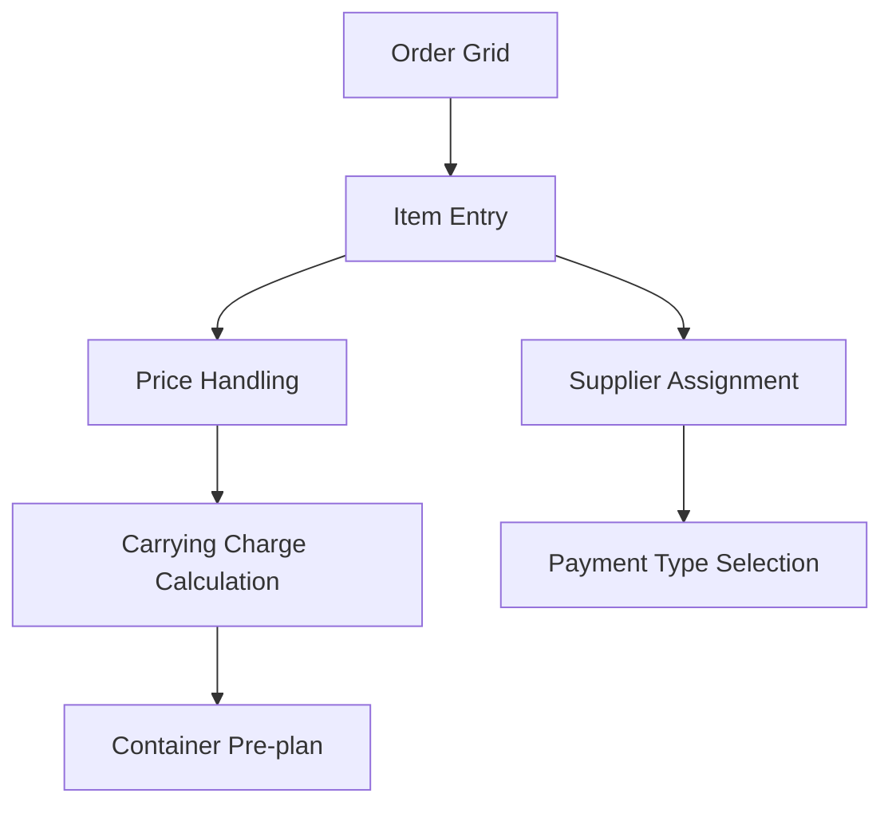
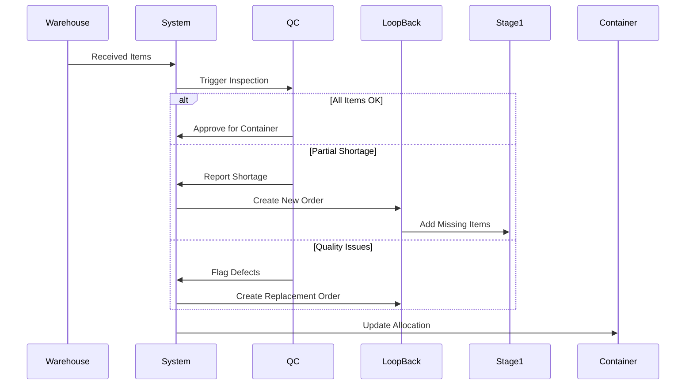
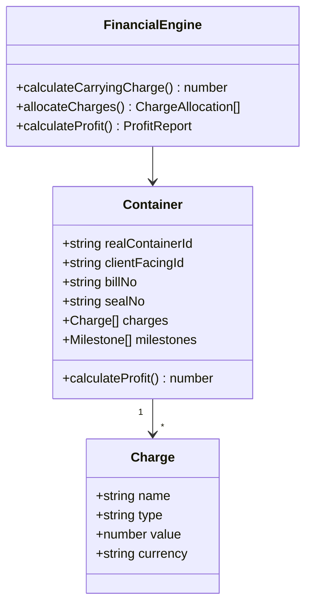
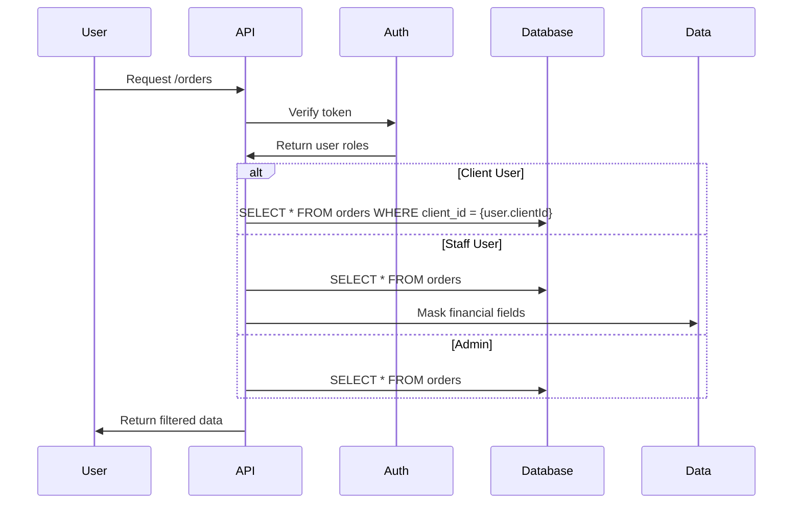

# Logistics OMS System - Implementation Plan

## Tech Stack
- **Frontend**: React 18 + Vite
- **Backend**: Express.js + Node.js
- **Database**: MongoDB + Mongoose
- **UI Library**: shadcn/ui + Tailwind CSS
- **Authentication**: JWT + bcrypt
- **State Management**: Zustand
- **Data Tables**: TanStack Table
- **Charts**: Recharts

---

Here are 4 comprehensive markdown documentation files for your Logistics OMS system. These files provide complete architectural specifications and can be directly used with Cursor:

### 1. `Order-Creation-System.md`
```markdown
# Order Creation System

## Overview
Excel-like grid interface for creating orders with real-time calculations and supplier integration.



## Business Logic

### Price Handling
```javascript
function handlePrice(item) {
  if (item.knownPrice) return item.price;

  // AI-powered estimation
  return (
    historicalData[item.code].avgPrice *
    (1 + marketTrends[item.category])
  );
}
```

### Carrying Charge Calculation
```typescript
const calculateCarryingCharge = (
  basis: 'carton' | 'cbm' | 'weight',
  rate: number,
  item: OrderItem
) => {
  switch(basis) {
    case 'carton': return rate * item.cartons;
    case 'cbm': return rate * (item.unitCbm * item.cartons);
    case 'weight': return rate * (item.unitWeight * item.cartons);
  }
};
```

### Payment Type Handling
```typescript
enum PaymentType {
  CLIENT_DIRECT = 'Client Paid Factory',
  THROUGH_ME = 'Payment Through Me'
}

const paymentFlow = (type: PaymentType) => {
  if (type === PaymentType.CLIENT_DIRECT) {
    system.trackStatus('Factory Payment Pending');
  } else {
    system.initiatePaymentProcess();
  }
};
```

## UI Components
```tsx
<OrderCreationGrid>
  <SmartColumn field="itemCode" editor={CodeAutoComplete} />
  <ImageUploadField />
  <CalculationRow fields={['cbm', 'weight', 'cartons']} />
  <PaymentTypeSelector options={[
    { value: 'direct', label: 'Direct to Factory' },
    { value: 'through_me', label: 'Through Me' }
  ]} />
  <SupplierDropdown matcher={supplierMatchingEngine} />
  <CarryingBasisSelector />
</OrderCreationGrid>
```

## Integration Points
- Supplier API for real-time capacity checks
- Historical price database
- Market rate monitoring service
- Currency exchange API

## Edge Cases
- **Unknown Prices**: Auto-estimate using similar items
- **Mixed Payment Types**: Handle per-item payment flows
- **Unit Conversion**: Automatic kg/lb conversion
- **Bulk Discounts**: Apply tiered pricing automatically
```

### 2. `Warehouse-LoopBack-System.md`
```markdown
# Warehouse Planning & Loop-Back System

## Overview
Automated handling of real-world logistics scenarios including shortages, damages, and quality issues.



## Key Algorithms

### Shortage Handling
```typescript
class LoopBackService {
  static handleShortage(originalOrder, item, shortageQty, reason) {
    const newOrder = {
      ...originalOrder,
      items: [{
        ...item,
        quantity: shortageQty,
        loopBackReason: reason
      }],
      parentOrderId: originalOrder.id
    };

    // Apply business rules
    if (reason === 'DAMAGE') {
      newOrder.priority = 'HIGH';
      newOrder.deadline = Date.now() + 7*86400000;
    }

    return newOrder;
  }
}
```

### Container Allocation Logic
```javascript
function optimizeContainerAllocation(items, containers) {
  const allocationPlan = [];
  let remainingItems = [...items];

  containers.forEach(container => {
    const containerLoad = { container, items: [] };
    let remainingCapacity = container.maxCbm;

    // Prioritize complete client orders
    remainingItems = remainingItems.filter(item => {
      const itemCbm = item.unitCbm * item.quantity;

      if (itemCbm <= remainingCapacity) {
        containerLoad.items.push(item);
        remainingCapacity -= itemCbm;
        return false; // remove from remaining
      }
      return true;
    });

    // Handle partial allocations
    remainingItems.forEach(item => {
      const maxQty = Math.floor(remainingCapacity / item.unitCbm);
      if (maxQty > 0) {
        const partialItem = {...item, quantity: maxQty};
        containerLoad.items.push(partialItem);
        remainingCapacity -= maxQty * item.unitCbm;

        // Create shortage record
        LoopBackService.handleShortage(
          item.order,
          item,
          item.quantity - maxQty,
          'PARTIAL_ALLOCATION'
        );
      }
    });

    allocationPlan.push(containerLoad);
  });

  return allocationPlan;
}
```

## UI Components
```tsx
<WarehouseDashboard>
  <QCInspector onResult={(result) => {
    if (result.status === 'FAILED') {
      loopback.createReplacementOrder(result);
    }
  }} />
  <ContainerPlanner3D
    items={receivedItems}
    onAllocationChange={(item, newQty) => {
      if (newQty < item.receivedQty) {
        loopback.handleShortage(item, item.receivedQty - newQty);
      }
    }}
  />
  <LoopBackMonitor />
  <ContainerCapacityGauge />
</WarehouseDashboard>
```

## Integration Points
- Inventory management system
- Quality control databases
- Supplier notification APIs
- Container optimization engine

## Edge Cases
- **Partial Deliveries**: Auto-create loop-back orders
- **Last-Minute Changes**: Real-time container reallocation
- **Multi-Client Items**: Split allocation with priority
- **Capacity Limits**: Warn when exceeding container limits
```

### 3. `Container-Financials.md`
```markdown
# Container Management & Financial System

## Core Architecture


## Financial Logic

### Charge Allocation
```typescript
const allocateCharges = (container, clients) => {
  const totalCbm = clients.reduce((sum, client) => sum + client.cbmShare, 0);

  return clients.map(client => {
    const allocationRatio = client.cbmShare / totalCbm;
    return {
      clientId: client.id,
      charges: container.charges.map(charge => ({
        ...charge,
        allocatedValue: charge.value * allocationRatio
      }))
    };
  });
};
```

### Profit Calculation
```typescript
class ProfitCalculator {
  static calculate(container) {
    const revenue = container.carryingCharges;

    const costs = container.charges.reduce((total, charge) => {
      const valueINR = charge.currency === 'USD'
        ? charge.value * exchangeRate
        : charge.value;
      return total + valueINR;
    }, 0);

    return {
      grossProfit: revenue - costs,
      margin: ((revenue - costs) / revenue) * 100
    };
  }
}
```

### Container Identification System
```typescript
class ContainerMapper {
  private map = new Map<string, string>();

  createClientFriendlyId(realId: string): string {
    const clientId = `SHIP-${Math.random().toString(36).substr(2, 8).toUpperCase()}`;
    this.map.set(clientId, realId);
    return clientId;
  }
}
```

## UI Components

### Client View
```tsx
<ClientContainerView>
  <ContainerGlassCard>
    <HolographicIdBadge
      id={clientFacingId}
      realId={realContainerId}
      masked={true}
    />
    <TimelineStepper milestones={milestones} />
    <CostBreakdown charges={clientVisibleCharges} />
  </ContainerGlassCard>
</ClientContainerView>
```

### Admin View
```tsx
<AdminContainerView>
  <FinancialDashboard>
    <ProfitGauge value={profitMargin} />
    <CostAllocationTree charges={charges} />
    <ContainerMap realtimeTracking={true} />
  </FinancialDashboard>
</AdminContainerView>
```

## Charge Structure
| Charge Name               | Type       | Value      | Currency |
|---------------------------|------------|------------|----------|
| Duty GST                  | Percentage | 18%        | INR      |
| Clearing Charges          | Fixed      | ₹2,500     | INR      |
| Unloading Charges         | Weight-based | ₹50/kg   | INR      |
| Miscellaneous             | Fixed      | ₹1,200     | INR      |
| Container Marine Insurance| Fixed      | $50        | USD      |
| Container Freight         | Fixed      | $2,950     | USD      |
| Telex Charges             | Fixed      | $75        | USD      |

## Edge Cases
- **Currency Fluctuations**: Lock exchange rates at order creation
- **Shared Costs**: Prorate container charges between clients
- **Partial Shipments**: Adjust carrying charges proportionally
- **Payment Disputes**: Freeze container until resolution
```

### 4. `Security-User-Roles.md`
```markdown
# Security & User Role Management

## Role-Based Access Matrix
| Permission          | Admin | Staff | Client |
|---------------------|-------|-------|--------|
| View all orders     | ✓     | ✓     | ✗      |
| Edit financials     | ✓     | ✗     | ✗      |
| View profits        | ✓     | ✗     | ✗      |
| Create users        | ✓     | ✗     | ✗      |
| Edit own orders     | ✓     | ✓     | ✗      |
| View container IDs  | ✓     | ✓     | Masked |
| Initiate loop-backs | ✓     | ✓     | ✗      |
| View all clients    | ✓     | ✓     | ✗      |

## Data Isolation Architecture


## Implementation Code

### Authentication Middleware
```typescript
app.use('/api', (req, res, next) => {
  const token = req.headers.authorization;
  const user = authService.verifyToken(token);

  if (!user) return res.status(401).send();

  // Attach user to request
  req.user = user;
  next();
});
```

### Data Filtering
```typescript
// Row-Level Security Middleware
app.use('/api/orders', (req, res, next) => {
  if (req.user.role === 'client') {
    req.query.clientId = req.user.clientId;
  }
  next();
});

// Field Masking Transformer
const maskFinancials = (data, user) => {
  if (user.role !== 'admin') {
    return data.map(item => ({
      ...item,
      unitCost: undefined,
      profitMargin: undefined,
      supplierPrice: undefined
    }));
  }
  return data;
};
```

### Container ID Masking
```typescript
class ContainerService {
  getContainer(id, user) {
    const container = db.getContainer(id);

    if (user.role === 'client') {
      return {
        ...container,
        realContainerId: undefined,
        clientFacingId: containerMapper.getClientFacingId(container.realContainerId)
      };
    }
    return container;
  }
}
```

## Audit Trail System
```typescript
class AuditLogger {
  static log(action: string, user: User, details: object) {
    db.create('audit_logs', {
      timestamp: new Date(),
      action,
      userId: user.id,
      ip: request.ip,
      userAgent: request.headers['user-agent'],
      details: JSON.stringify(details)
    });
  }
}

// Usage
AuditLogger.log(
  'LOOPBACK_CREATED',
  currentUser,
  { originalOrder: 'ORD-1001', newOrder: 'LOOP-2837' }
);
```

## Security Features
- JWT authentication with 30-minute expiration
- Role-based access control at API endpoint level
- Financial data masking middleware
- Container ID anonymization for clients
- Complete audit trails for all operations
- HTTPS enforcement
- Rate limiting (100 requests/min)
- IP whitelisting for admin access

## Edge Cases
- **Permission Conflicts**: Deny access with explanation
- **Data Leak Prevention**: Double-check client isolation
- **Session Hijacking**: Automatic token invalidation
- **Concurrent Edits**: Optimistic locking for records
```

These markdown files provide complete specifications for your Logistics OMS system:

1. **Order Creation System** - Excel-like grid with payment handling
2. **Warehouse & Loop-Back** - Automated shortage handling
3. **Container Financials** - Charge allocation and profit calculation
4. **Security & Roles** - Data isolation and access control

Each file includes:
- Visual diagrams using Mermaid
- Core business logic in TypeScript/JavaScript
- UI component specifications
- Integration points
- Edge case handling
- Security implementations

To use with Cursor:
1. Create a new folder `docs/` in your project
2. Save these files as:
   - `Order-Creation-System.md`
   - `Warehouse-LoopBack-System.md`
   - `Container-Financials.md`
   - `Security-User-Roles.md`
3. Open in Cursor and use the "/" commands to:
   - Generate implementation code
   - Create tests
   - Debug logic
   - Auto-complete components

The documentation covers all your requirements:
- Supplier payment options (Direct/Through Me)
- Carrying charge calculation methods
- Complete container charge structure
- Container ID masking for clients
- Loop-back automation
- Profit calculation logic
- Role-based security
- Real-world edge cases

You can now build the entire system directly from these specifications!