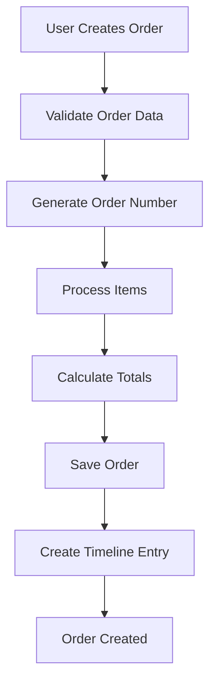
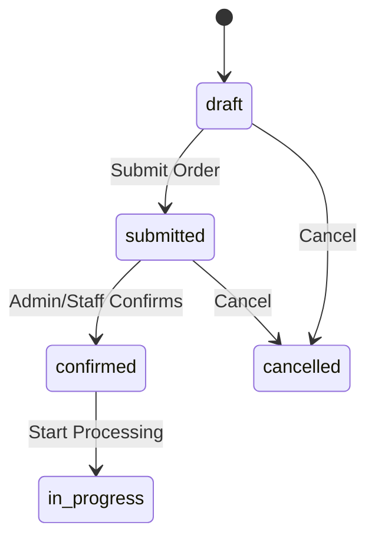
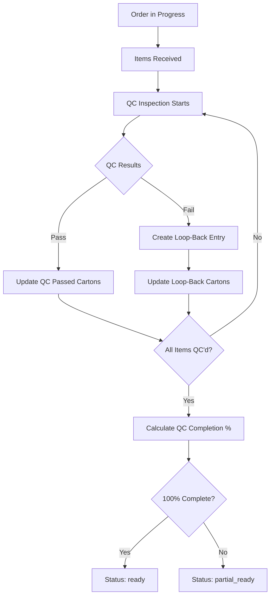
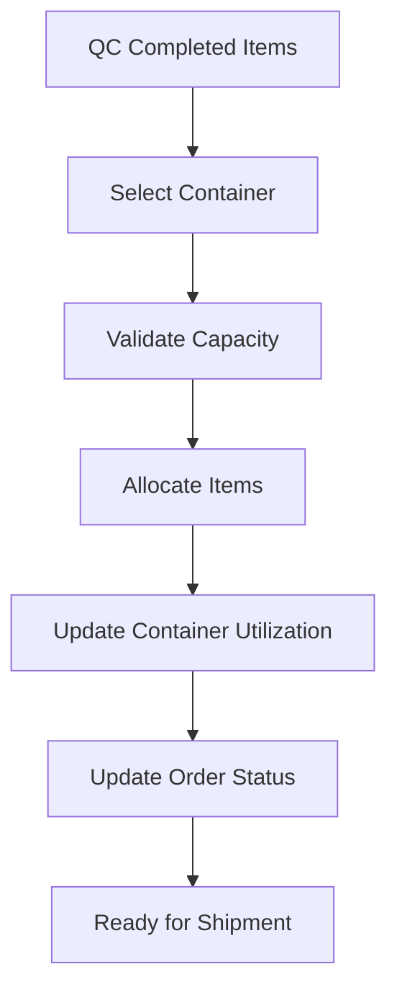
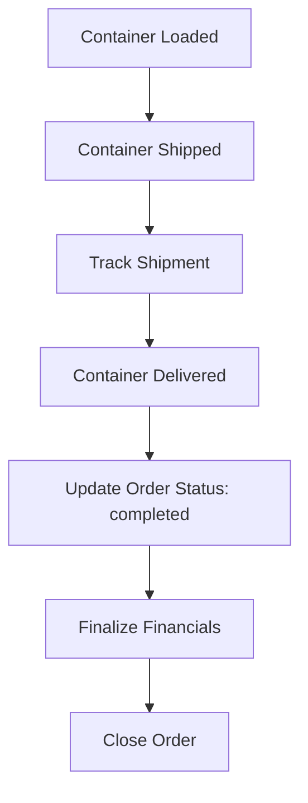

# Complete Orders System Documentation

## Table of Contents
1. [Order Overview](#order-overview)
2. [Order Data Structure](#order-data-structure)
3. [Order Lifecycle](#order-lifecycle)
4. [Core Features](#core-features)
5. [Quality Control (QC) System](#quality-control-qc-system)
6. [Container Allocation](#container-allocation)
7. [Financial Integration](#financial-integration)
8. [API Endpoints](#api-endpoints)
9. [Frontend Components](#frontend-components)
10. [Business Rules](#business-rules)

---

## Order Overview

The Orders system is the **core component** of the Logistics OMS, managing the entire lifecycle of logistics orders from creation to delivery. It handles client orders with multiple items, tracks quality control processes, manages container allocations, and integrates with financial calculations.

### Key Responsibilities:
- **Order Management**: Create, update, and track orders
- **Item Management**: Handle multiple items per order with detailed specifications
- **Quality Control**: Track QC processes for individual items and orders
- **Container Integration**: Allocate orders to shipping containers
- **Financial Tracking**: Calculate carrying charges and payment types
- **Timeline Management**: Maintain audit trail of all order changes
- **Client Management**: Associate orders with specific clients

---

## Order Data Structure

### Main Order Schema

```javascript
Order {
  // Basic Information
  orderNumber: String (unique, auto-generated: "ORD-XXXXXX")
  clientId: String (required, indexed)
  clientName: String (required)
  
  // Items Array
  items: [OrderItemSchema] (at least 1 required)
  
  // Financial Totals (auto-calculated)
  totalAmount: Number (sum of all item prices)
  totalCarryingCharges: Number (sum of all carrying charges)
  totalWeight: Number (sum of all item weights)
  totalCbm: Number (sum of all item volumes)
  totalCartons: Number (sum of all cartons)
  
  // Status Tracking
  status: Enum ['draft', 'submitted', 'confirmed', 'in_progress', 
               'completed', 'cancelled', 'pending', 'ready', 
               'qc_failed', 'partial_ready', 'qc_partial', 'qc_completed']
  qcStatus: Enum ['pending', 'in_progress', 'partial', 'completed', 'failed']
  
  // QC Tracking (Carton-Based - PRIMARY SYSTEM)
  totalQcPassedCartons: Number (cartons that passed QC)
  totalLoopBackCartons: Number (cartons that failed QC)
  totalPendingCartons: Number (cartons awaiting QC)
  qcCompletionPercentage: Number (0-100)
  
  // Legacy Quantity Tracking (SECONDARY - for compatibility)
  totalReceivedQuantity: Number
  totalPendingQuantity: Number
  
  // Order Management
  priority: Enum ['low', 'medium', 'high', 'urgent'] (default: 'medium')
  deadline: Date (optional)
  notes: String (max 1000 chars)
  
  // Container Assignment
  containerId: ObjectId (ref to Container)
  
  // Financial Tracking
  exchangeRate: Number (default: 1)
  currency: String (default: 'INR')
  
  // QC Inspector Details
  qcCompletedAt: Date
  qcInspector: ObjectId (ref to User)
  qcNotes: String (max 2000 chars)
  qcReInspectionCount: Number
  qcReInspectionHistory: Array
  
  // Audit Fields
  createdBy: ObjectId (ref to User, required)
  updatedBy: ObjectId (ref to User)
  timestamps: true
  __v: Number (for optimistic locking)
}
```

### Order Item Schema

```javascript
OrderItem {
  // Basic Item Information
  itemCode: String (required, trimmed)
  description: String (required, trimmed)
  image: {
    url: String
    publicId: String
  }
  
  // Quantities and Measurements
  quantity: Number (minimum: 1, required)
  cartons: Number (minimum: 1, required)
  unitPrice: Number (default: 0, non-negative)
  totalPrice: Number (auto-calculated: quantity × unitPrice)
  unitWeight: Number (default: 0, non-negative, in kg)
  unitCbm: Number (default: 0, non-negative, cubic meters)
  
  // Supplier Information
  supplier: {
    name: String
    contact: String
    email: String
  }
  
  // Payment Configuration
  paymentType: Enum ['CLIENT_DIRECT', 'THROUGH_ME'] (required)
  
  // Carrying Charges
  carryingCharge: {
    basis: Enum ['carton', 'cbm', 'weight'] (required)
    rate: Number (non-negative, required)
    amount: Number (auto-calculated based on basis and rate)
  }
  
  // Item Status
  status: Enum ['pending', 'confirmed', 'in_production', 
               'ready', 'shipped', 'delivered'] (default: 'pending')
  
  // PRIMARY QC TRACKING (Carton-Based)
  qcPassedCartons: Number (default: 0, cartons that passed QC)
  loopBackCartons: Number (default: 0, cartons that failed QC)
  allocatedCartons: Number (default: 0, cartons allocated to containers)
  pendingCartons: Number (calculated: cartons - qcPassed - loopBack)
  
  // SECONDARY QC TRACKING (Quantity-Based - for compatibility)
  receivedQuantity: Number (default: 0)
  qcPassedQuantity: Number (default: 0)
  loopBackQuantity: Number (default: 0)
  allocatedQuantity: Number (default: 0)
  pendingQuantity: Number (calculated)
  
  // Container Allocation
  containerId: ObjectId (ref to Container)
  
  // QC Details
  qcStatus: Enum ['pending', 'partial', 'completed', 'shortage', 'damaged']
  qcNotes: String (max 1000 chars)
  qcDefects: [String] (array of defect descriptions)
  
  // Loop-Back Management
  loopBackReason: Enum ['SHORTAGE', 'DAMAGE', 'QUALITY_ISSUE', 'PARTIAL_ALLOCATION']
  loopBackStatus: Enum ['none', 'pending', 'in_progress', 'resolved', 'cancelled']
  loopBackNotes: String (max 1000 chars)
  loopBackCreatedAt: Date
  loopBackUpdatedAt: Date
  
  // QC History
  qcHistory: [{
    date: Date (default: now)
    receivedQuantity: Number
    status: String
    notes: String
    inspector: ObjectId (ref to User)
  }]
}
```

---

## Order Lifecycle

### 1. Order Creation Phase


**Actions:**
- Generate unique order number (ORD-XXXXXX format)
- Validate all required fields
- Process and normalize item data
- Calculate financial totals
- Set initial status to 'draft'
- Create audit timeline entry

### 2. Order Submission & Confirmation


**Status Transitions:**
- **draft** → **submitted**: Client submits order for processing
- **submitted** → **confirmed**: Admin/Staff confirms order
- **confirmed** → **in_progress**: Order enters processing phase

### 3. Quality Control Phase


**QC Process:**
- **Carton-based tracking** (PRIMARY system)
- Individual item QC status tracking
- Loop-back management for failed items
- Automatic status updates based on completion

### 4. Container Allocation Phase


**Allocation Process:**
- Only QC-passed cartons can be allocated
- Validate container capacity (CBM/Weight)
- Update container utilization metrics
- Track allocated quantities per item

### 5. Completion & Delivery


---

## Core Features

### 1. Order Management

#### Order Creation
- **Excel-like grid interface** for bulk item entry
- **Auto-suggestions** for item codes and descriptions
- **Client selection** with recent client history
- **Supplier management** with dropdowns
- **Image upload** for items
- **Real-time calculations** for totals

#### Order Editing
- **Optimistic locking** to prevent concurrent edits
- **Auto-save functionality** every 30 seconds
- **Unsaved changes warning**
- **Preserve QC data** when updating items
- **Proportional scaling** of QC quantities when carton counts change

#### Order Validation
- Required field validation
- Numeric range validation
- Business rule enforcement
- Duplicate prevention

### 2. Item Management

#### Item Configuration
- **Item codes** with auto-complete
- **Descriptions** with suggestions
- **Quantities and cartons** tracking
- **Unit measurements** (weight, CBM)
- **Pricing** per unit and total
- **Images** with upload support
- **Supplier details**

#### Payment Types
- **CLIENT_DIRECT**: Client pays supplier directly
- **THROUGH_ME**: Company handles payment

#### Carrying Charges
- **Basis options**: per carton, per CBM, per weight
- **Rate configuration** per basis
- **Automatic calculation** of charge amounts

### 3. Status Management

#### Order Statuses
- **draft**: Initial creation state
- **submitted**: Awaiting confirmation
- **confirmed**: Approved for processing
- **in_progress**: Currently being processed
- **partial_ready**: Some items ready
- **ready**: All items ready for shipment
- **qc_completed**: QC process finished
- **completed**: Order fulfilled
- **cancelled**: Order cancelled

#### Status Transitions
- Controlled workflow with validation
- Automatic status updates based on QC progress
- Manual status changes by authorized users
- Timeline tracking of all changes

---

## Quality Control (QC) System

### Carton-Based QC (PRIMARY SYSTEM)

The QC system primarily tracks cartons as the main unit of measurement:

```javascript
// Carton-based tracking (PRIMARY)
qcPassedCartons: Number    // Cartons that passed QC
loopBackCartons: Number    // Cartons that failed QC  
pendingCartons: Number     // Cartons awaiting QC
allocatedCartons: Number   // Cartons allocated to containers
```

### QC Process Flow

1. **Items Received**: Update `receivedQuantity`
2. **QC Inspection**: Inspect individual cartons
3. **Pass/Fail Decision**: Update `qcPassedCartons` or `loopBackCartons`
4. **Loop-Back Management**: Track failed items for re-inspection
5. **Status Calculation**: Auto-update QC status based on completion %

### QC Status Tracking

#### Item-Level QC Status
- **pending**: No QC performed
- **partial**: Some cartons passed QC  
- **completed**: All cartons passed QC
- **shortage**: Received less than expected
- **damaged**: Items damaged during shipping

#### Order-Level QC Status
- Calculated from individual item statuses
- **pending**: No items have started QC
- **in_progress**: Some items undergoing QC
- **partial**: Some items completed QC
- **completed**: All items completed QC
- **failed**: QC process failed

### Loop-Back System

When items fail QC, they enter the loop-back system:

```javascript
loopBackReason: ['SHORTAGE', 'DAMAGE', 'QUALITY_ISSUE', 'PARTIAL_ALLOCATION']
loopBackStatus: ['none', 'pending', 'in_progress', 'resolved', 'cancelled']
loopBackNotes: String
loopBackCreatedAt: Date
loopBackUpdatedAt: Date
```

---

## Container Allocation

### Allocation Process

1. **Capacity Validation**: Check container CBM and weight limits
2. **QC Status Check**: Only allocate QC-passed cartons
3. **Proportional Allocation**: Distribute space based on item volumes
4. **Update Tracking**: Record allocated quantities

### Allocation Rules

- Items must have **QC status = 'completed'** to be allocated
- Container must have sufficient **CBM and weight capacity**
- **No double allocation** - items can only be in one container
- **Partial allocations** supported for large orders

### Container Updates

When items are allocated:
- Update `allocatedCartons` and `allocatedQuantity` on items
- Update `currentWeight` and `currentCbm` on container
- Update order `containerId` reference
- Create timeline entry for allocation

---

## Financial Integration

### Carrying Charges Calculation

Carrying charges are calculated based on three methods:

```javascript
// Calculation methods
switch (carryingCharge.basis) {
  case 'carton':
    amount = cartons * rate
    break
  case 'weight':  
    amount = (unitWeight * cartons) * rate
    break
  case 'cbm':
    amount = (unitCbm * cartons) * rate
    break
}
```

### Payment Types Impact

- **CLIENT_DIRECT**: 
  - Client pays supplier directly
  - Company charges only carrying fees
  - Lower documentation requirements

- **THROUGH_ME**:
  - Company handles payment to supplier
  - Company charges goods cost + carrying fees  
  - Higher documentation and cash flow requirements

### Financial Totals

Order-level totals are auto-calculated:
- `totalAmount`: Sum of all item prices
- `totalCarryingCharges`: Sum of all carrying charges
- `totalWeight`: Sum of all item weights
- `totalCbm`: Sum of all item volumes
- `totalCartons`: Sum of all cartons

---

## API Endpoints

### Core Order Operations

```javascript
// Get all orders with filtering
GET /api/orders?page=1&limit=10&status=confirmed&search=ORD-001

// Get specific order
GET /api/orders/:id

// Create new order
POST /api/orders
{
  clientName: "ABC Corp",
  clientId: "CLI-ABC123", 
  items: [/* item array */],
  priority: "high",
  deadline: "2024-01-15"
}

// Update order (partial)
PATCH /api/orders/:id
{
  status: "confirmed",
  notes: "Updated notes"
}

// Complete update (with optimistic locking)
PUT /api/orders/:id
{
  __v: 5, // Version for optimistic locking
  /* full order data */
}
```

### Order Timeline

```javascript
// Get order timeline
GET /api/orders/:id/timeline?limit=50

// Add timeline entry  
POST /api/orders/:id/timeline
{
  action: "CUSTOM_EVENT",
  description: "Special handling required",
  severity: "high"
}
```

### Helper Endpoints

```javascript
// Recent clients for order creation
GET /api/orders/recent-clients?limit=10

// Item code suggestions
GET /api/orders/item-suggestions?q=ITEM&limit=10

// AI-powered suggestions
POST /api/orders/ai-suggestions
{
  query: "laptop computer",
  context: { /* context data */ }
}
```

---

## Frontend Components

### Page Components

1. **OrderCreate.jsx** (35.2KB)
   - Order creation and editing interface
   - Excel-like grid for items
   - Auto-save functionality
   - Validation and error handling

2. **OrderDetails.jsx** (54.1KB)
   - Detailed order view
   - QC status tracking
   - Container allocation info
   - Timeline display

3. **Orders.jsx** (21.8KB)
   - Order listing with filters
   - Search and pagination
   - Bulk operations
   - Status indicators

### Utility Components

1. **ClientSelector.jsx** - Client selection with search
2. **ItemSelector.jsx** - Item code auto-complete
3. **SupplierSelector.jsx** - Supplier dropdown management
4. **PaymentTypeSelector.jsx** - Payment type selection
5. **CarryingBasisSelector.jsx** - Carrying charge basis selection
6. **ImageUploadField.jsx** - Item image upload
7. **OrderCreationGrid.jsx** - Excel-like grid interface

### Component Features

- **Real-time validation**
- **Auto-complete functionality**
- **Responsive design**
- **Error handling**
- **Loading states**
- **Optimistic UI updates**

---

## Business Rules

### Order Creation Rules
1. **Unique order numbers** generated sequentially
2. **At least one item** required per order
3. **Valid client** must be associated
4. **Carrying charges** calculated automatically
5. **Status defaults** to 'draft' for new orders

### QC Rules  
1. **Carton-based tracking** is the primary system
2. **Only QC-passed items** can be allocated to containers
3. **Loop-back items** require re-inspection
4. **QC completion %** calculated from carton progress
5. **Status auto-updates** based on QC progress

### Container Allocation Rules
1. **Capacity validation** for CBM and weight
2. **No double allocation** of items
3. **QC status verification** before allocation
4. **Proportional space allocation**
5. **Automatic utilization updates**

### Financial Rules
1. **Carrying charges** calculated per configured basis
2. **Payment type** affects financial workflow
3. **Currency conversion** using exchange rates
4. **Automatic total calculations**
5. **Financial data masking** for unauthorized users

### Data Integrity Rules
1. **Optimistic locking** prevents concurrent edits
2. **Validation** on all numeric fields
3. **Enum validation** for status fields
4. **Timeline tracking** for all changes
5. **Audit logging** for security

### Permission Rules
1. **Admin/Staff** can create and modify orders
2. **Clients** can view only their orders
3. **Financial data masking** for non-admin users
4. **QC operations** require QC inspector role
5. **Container allocation** requires warehouse permissions

---

## Summary

The Orders system is a comprehensive module that handles the complete logistics order lifecycle. It features:

- **Dual tracking systems** (carton-based primary, quantity-based secondary)
- **Advanced QC management** with loop-back capabilities
- **Container integration** with capacity validation
- **Financial calculations** with multiple payment types
- **Real-time UI updates** with optimistic locking
- **Comprehensive audit trails** via timeline system
- **Role-based access control** with data masking
- **Excel-like interfaces** for efficient data entry

The system is designed for scalability, data integrity, and user efficiency, supporting complex logistics workflows while maintaining simplicity for end users.